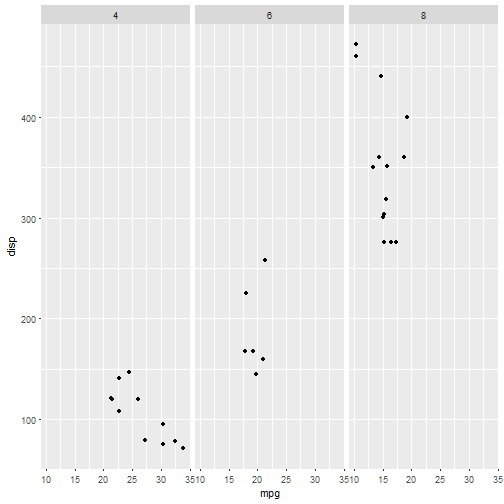
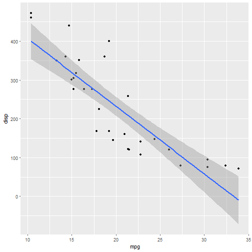
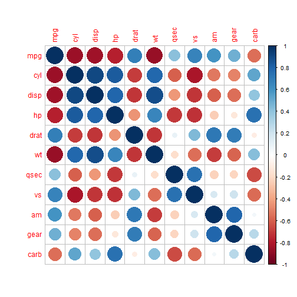

## Project Introduction

The first goal of this project is to create a shiny app the allows and end user interact with a data set by using a variety of widgets.

https://scottpurvis.shinyapps.io/Week4Project/

The second goal was to create a web page using Slidify 

https://github.com/Scott-Purvis/DataProductsProj


--- .class #id 

## mtcars dataset

```r
data(mtcars)
head(mtcars)
```

```
##                    mpg cyl disp  hp drat    wt  qsec vs am gear carb
## Mazda RX4         21.0   6  160 110 3.90 2.620 16.46  0  1    4    4
## Mazda RX4 Wag     21.0   6  160 110 3.90 2.875 17.02  0  1    4    4
## Datsun 710        22.8   4  108  93 3.85 2.320 18.61  1  1    4    1
## Hornet 4 Drive    21.4   6  258 110 3.08 3.215 19.44  1  0    3    1
## Hornet Sportabout 18.7   8  360 175 3.15 3.440 17.02  0  0    3    2
## Valiant           18.1   6  225 105 2.76 3.460 20.22  1  0    3    1
```

---
## mpg and disp by Cylinder

```r
ggplot(mtcars, aes(mpg, disp))+geom_point()+facet_grid(.~cyl)
```




---

## Individual Correlation

```r
ggplot(mtcars, aes(mpg, disp)) + geom_point()+geom_smooth(method = "lm")
```



---

## Correlation Plots

```r
corrplot(cor(mtcars),method="circle")
```




